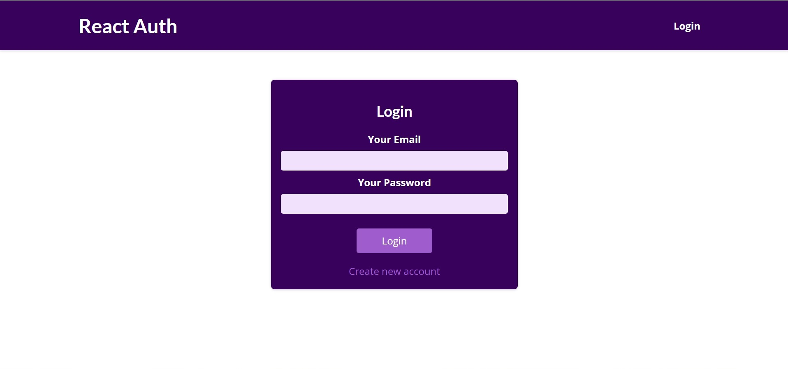
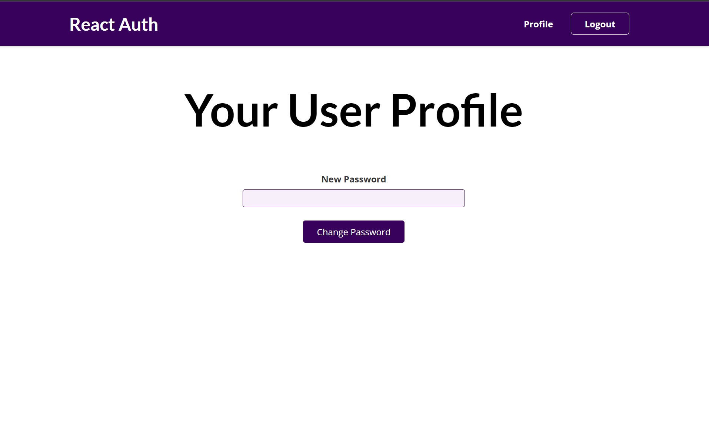

## Screenshots





# Authentication-App

Authentication demo that signup/login users or changing password for login user.

using google Firebase to authenticate existing users and storing new users.

using browser local storage to remember logged in users. 

navbar is responsive and will change upon login/logout.
## Installation

Install Authentication-App with npm

```bash
  cd Authentication-App
  npm install package.json
```
    
## Environment Variables

To run this project, you will need to add the following environment variables to your .env file

`REACT_APP_FB_KEY`

Firebase key 

Link: https://firebase.google.com/

